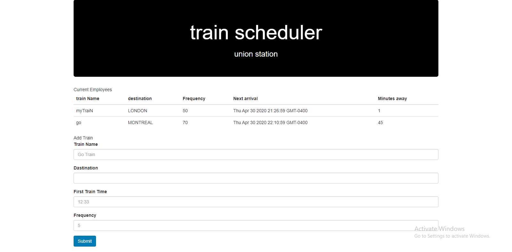

# train-scheduler
the app takes information about train name, destination, first train time and frequency, stores information in the firebase, counts next train arrival time as well compares current time and shows on the browser how many  minutes away is the train

